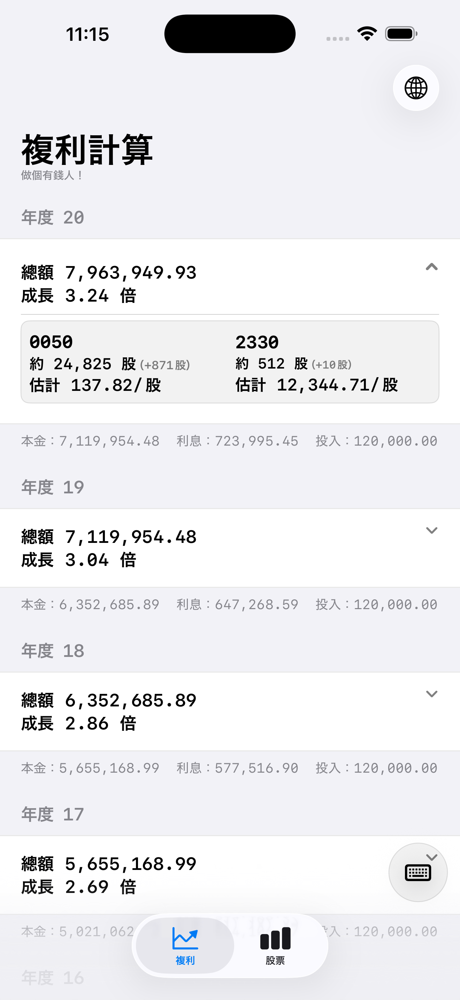
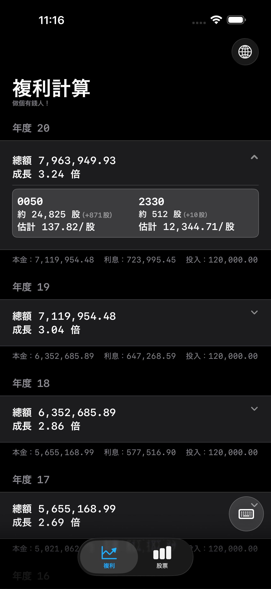
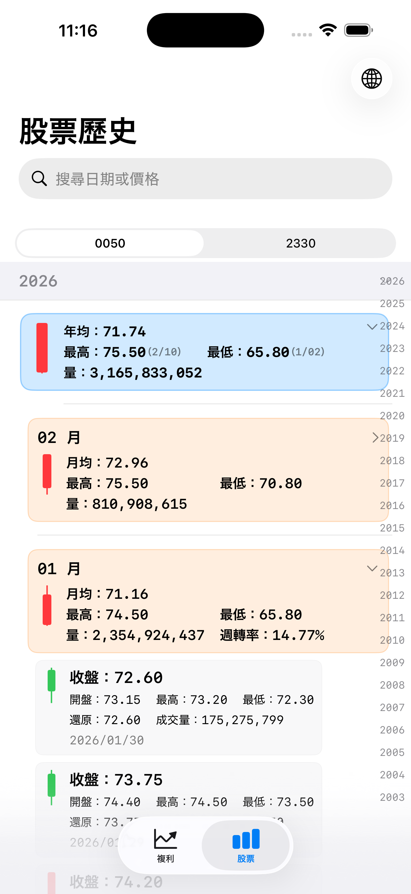
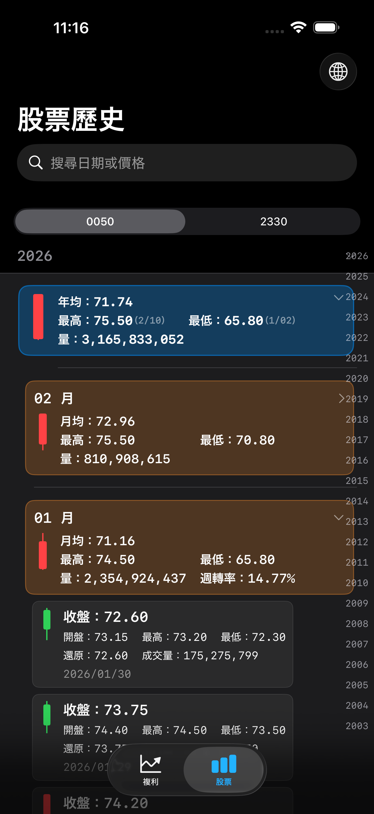

# Compound Interest（繁體中文）

Compound Interest 是一個 iOS SwiftUI App，整合了：

- 複利試算（本金 + 可選的每年固定投入）
- 台股歷史資料瀏覽（`0050`、`2330`）
- 1～20 年股票估價與約當股數推算（支援零股）

語言版本：

- 繁中（本檔）
- English: `README.md`

## 主要功能

- `Compound` 分頁：
  - 年度複利結果即時更新
  - 輸入面板支援本金、每年固定投入、成長率回溯區間（`3Y/5Y/10Y`）
  - 顯示 `0050 / 2330` 的估計股價與約當股數（含當年度新增股數）
- `Stock` 分頁：
  - `0050 / 2330` 分段切換
  - 年/月/日分層清單，支援展開/收合與年份索引跳轉
  - 年/月摘要卡與日 K 線（台股紅漲綠跌）
- 多語系：
  - 英文 + 繁中，可在 App 內切換
- 主題一致：
  - 使用 `AppTheme.swift` 進行深淺模式一致配色

## 快速開始

1. 開啟 `Compound Interest.xcodeproj`
2. 選擇模擬器或實機
3. Build & Run

## 截圖

請將截圖放在 `docs/images/`，建議檔名如下：

- `compound-light.png`
- `compound-dark.png`
- `stock-history-light.png`
- `stock-history-dark.png`

README 已預留顯示：






## 資料來源與轉檔

來源資料夾：

- `0050_history/`
- `2330_history/`

產生 App 使用 JSON：

```bash
python3 scripts/stock_csv_pipeline.py --root "/Users/sam/Developer/Compound Interest"
```

若要同時正規化 CSV 編碼（UTF-8 BOM）：

```bash
python3 scripts/stock_csv_pipeline.py --root "/Users/sam/Developer/Compound Interest" --normalize
```

## 文件

- 產品說明（英文）：`README.md`
- 產品說明（繁中）：`README.zh-Hant.md`
- 技術文件：`TECHNICAL_README.md`

## 授權

本專案採用 MIT License，請見 `LICENSE`。

## 免責聲明

- 本 App 與本專案內容僅供教育與資訊用途。
- 不構成投資建議、財務建議、稅務建議或法律建議。
- 歷史資料與模型推估不代表未來績效保證。
- 任何投資決策與風險均由使用者自行承擔。
